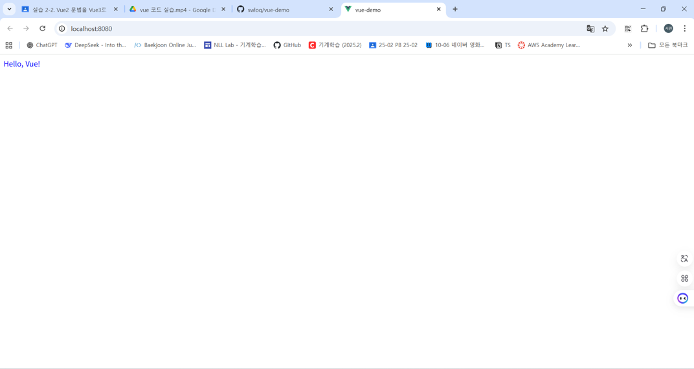
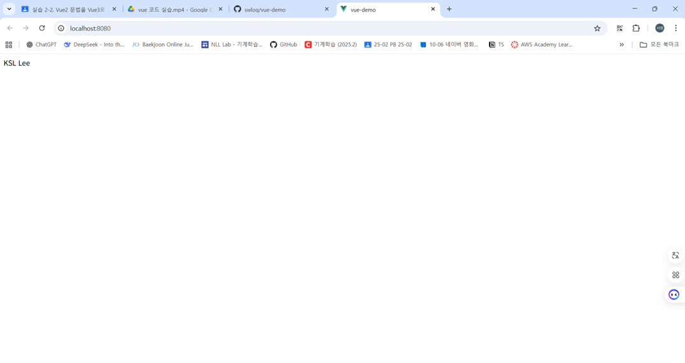
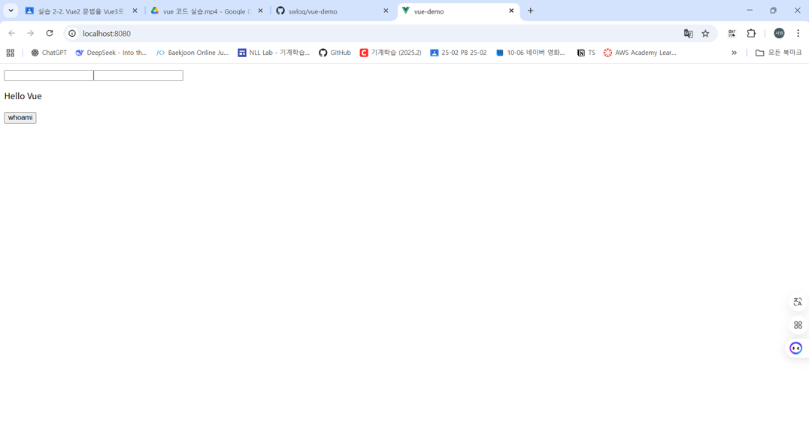

# vue-demo
# Vue2 → Vue3 Migration Examples
본 프로젝트는 Vue 2 기반 예제를 Vue 3 스타일로 리팩터링한 자료입니다.  
기능 추가 없이, 기존 동작과 화면을 그대로 유지하면서 코드 구조를 Vue 3 문법으로 전환했습니다.

## E-01-Instance 

### ✅ 변경 요약 (E01Instance.vue)
- **data() → ref():**  
  Vue 2의 `data()` 옵션을 Vue 3의 `ref()` 함수로 대체,`message` 변수를 `ref('Vue!')`로 선언하여 반응형 데이터로 관리.

- **<script> → <script setup>:**    
  Vue 2의 `export default { ... }` 구조를 제거하고 Vue 3의 `<script setup>`을 사용해 컴포넌트 정의를 간소화.

- **name 옵션 제거:**    
  Options API에서 사용하던 `name: "E01Instance"` 속성이 제거. <script setup>을 사용하면 파일이름이 컴포넌트 이름으로 자동 설정
---

### 💡 실행 결과

## E-02-Reactive 

### ✅ 변경 요약

- **data() → ref():**    
  Vue 2의 `data()` 옵션을 Vue 3에서는 `ref()` 함수로 대체,`firstName`,`lastName`을 `ref()`로 선언해 반응형 상태로 관리.

- **computed 속성 변환:**    
  Vue 2의 `computed` 옵션을 Composition API의 `computed()` 함수로 변경,`fullName`을 `computed(() => \`\${firstName.value} \${lastName.value}\`)`로 선언.

- **mounted() → onMounted():**   
  라이프사이클 훅을 Composition API 문법으로 변경,`onMounted(() => { ... })`로 선언하여 동일한 타이밍에 동작.

- **this 제거:**    
  `<script setup>` 내부에서는 `this`를 사용하지 않음,`this.firstName` 대신 `firstName.value` 형태로 접근.

- **Composition API 도입:**    
  `import { ref, computed, onMounted } from 'vue'`를 통해  
  반응형 상태, 계산 속성, 라이프사이클 훅을 명시적으로 관리.

---

### 💡 실행 결과

  
  

## 🧩 E-03-Binding 

### ✅ 변경 요약

- **Composition API 전환:**  
  Vue 2의 Options API(`data`, `methods`)를 Vue 3의 Composition API(`<script setup>`)로 전환.      
  →`import { ref } from 'vue'`를 통해 반응형 상태(`message`, `id`, `password`)를 명시적으로 선언.    
  → 불필요한 `export default` 및 `this` 참조 제거로 코드 구조 단순화.  

- **data() → ref():**    
  Vue 2의 `data()` 옵션을 Composition API의 `ref()`로 변환, `message`, `id`, `password`를 모두 `ref()`로 선언하여 반응형 상태로 관리.

- **메서드 정의 방식 변경:**  
  Vue 2의 `methods` 옵션 대신 Composition API 문법으로 함수 정의.  
  → `const updateMessage = () => { ... }` 형태로 선언.  
  → 버튼 클릭 시 `message.value = ${id.value} ${password.value}` 로 갱신.

- **이벤트 핸들러 변경:**  
  템플릿의 인라인 화살표 함수 `@click="() => { ... }"`를 제거하여 <script setup> 내부에 별도의 `updateMessage 함수`를 정의하여 참조하도록 변경.    
  → `@click="updateMessage"` 형태로 단순화. 

  
---

### 💡 실행 결과

