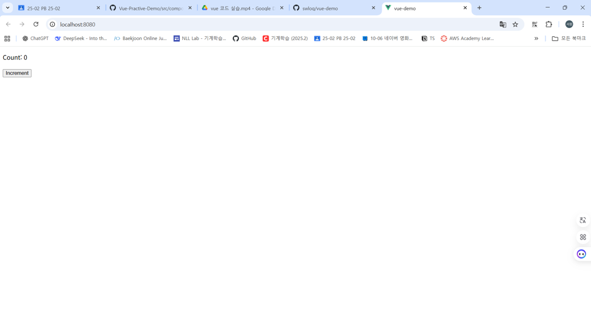
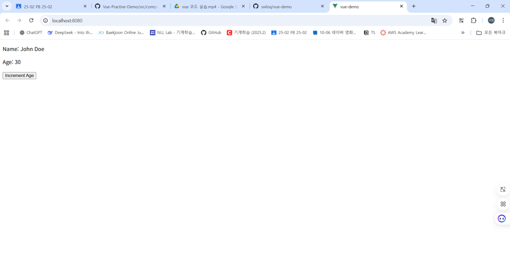
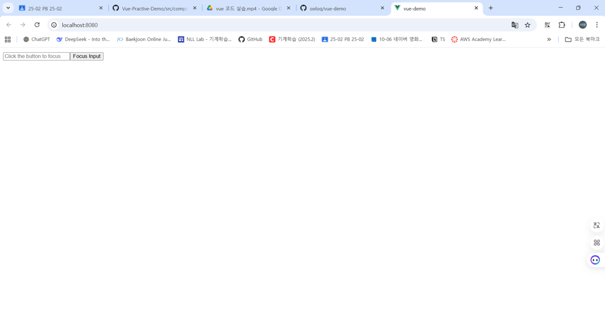

# Vue 2 → Vue 3 Migration Guide

> Vue 2 기반 코드를 Vue 3 Composition API + TypeScript로 전환한 실습 프로젝트

## 📑 목차

- [프로젝트 개요](#프로젝트-개요)
- [실행 방법](#실행-방법)
- [공통 변경사항](#공통-변경사항)
- [예제 목록](#예제-목록)
    - [01. Instance](#01-instance---기본-인스턴스-생성)
    - [02. Reactive](#02-reactive---반응형-데이터)
    - [03. Binding](#03-binding---데이터-바인딩)
    - [04. Directives](#04-directives---디렉티브-활용)
    - [05. Props & Emit](#05-props--emit---부모자식-컴포넌트-통신)
    - [06. Provide & Inject](#06-provide--inject---의존성-주입)
    - [07. Options API](#07-options-api---옵션-api-전환)
    - [08. Composition API](#08-composition-api---setup-함수-방식)
    - [09. Composition API 2](#09-composition-api-2---이중-스크립트-블록)
    - [10. Ref (Primitive)](#10-ref-primitive---기본형-반응성)
    - [11. Reactive (Object)](#11-reactive-object---객체-반응성)
    - [12. Ref (Component)](#12-ref-component---dom-요소-접근)
- [주요 학습 포인트](#주요-학습-포인트)
- [마이그레이션 체크리스트](#마이그레이션-체크리스트)

---

## 📖 프로젝트 개요

본 프로젝트는 **Vue 2에서 Vue 3로의 마이그레이션 과정**을 단계별로 학습하기 위한 예제 모음입니다.

### 주요 특징

- ✅ 기존 기능과 화면을 동일하게 유지
- ✅ Vue 3 Composition API 적용
- ✅ TypeScript 타입 안정성 확보
- ✅ `<script setup>` 문법으로 간결한 코드 작성

---

## 🚀 실행 방법

```bash
# 의존성 설치
npm install

# 개발 서버 실행
npm run dev

# 빌드
npm run build
```

---

## 🔄 공통 변경사항

모든 예제에 공통으로 적용된 Vue 3 마이그레이션 변경사항입니다.

### 1. `<script>` → `<script setup lang="ts">`

**Vue 2:**
```vue
<script>
export default {
  name: 'MyComponent',
  // ...
}
</script>
```

**Vue 3:**
```vue
<script setup lang="ts">
// export default 불필요
// TypeScript 타입 안정성 확보
</script>
```

### 2. 컴포넌트 자동 등록

**Vue 2:**
```vue
<script>
import ChildComponent from './ChildComponent.vue'

export default {
  components: {
    ChildComponent
  }
}
</script>
```

**Vue 3:**
```vue
<script setup lang="ts">
import ChildComponent from './ChildComponent.vue'
// components 옵션 불필요, import만으로 자동 등록
</script>
```

### 3. `this` 키워드 제거

**Vue 2:**
```javascript
this.message = 'Hello'
this.increment()
```

**Vue 3:**
```typescript
message.value = 'Hello'
increment()
```

---

## 📚 예제 목록

## 01. Instance - 기본 인스턴스 생성

> **폴더:** `example1/E-01-instance.vue`

### 학습 목표

Vue 인스턴스 생성 방식의 기본적인 변화를 이해합니다.

### 주요 변경사항

#### 1. `data()` → `ref()`

**Vue 2:**
```javascript
export default {
  name: "E01Instance",
  data() {
    return {
      message: "Vue!"
    };
  }
};
```

**Vue 3:**
```typescript
import { ref } from 'vue'

// 반응형 변수 선언 (기존 data() 역할)
const message = ref('Vue!')
```

#### 2. `name` 옵션 제거

- Options API의 `name: "E01Instance"` 속성 제거
- 파일명이 컴포넌트 이름으로 자동 설정

#### 3. 템플릿은 동일

```vue
<template>
  <div>Hello, {{ message }}</div>
</template>
```

### 실행 결과


---

## 02. Reactive - 반응형 데이터

> **폴더:** `example1/E-02-reactive.vue`

### 학습 목표

computed 속성과 라이프사이클 훅의 변환 방법을 학습합니다.

### 주요 변경사항

#### 1. `data()` → `ref()`

**Vue 2:**
```javascript
data()
{
  return {
    firstName: "Kyungsu",
    lastName: "Lee"
  };
}
```

**Vue 3:**
```typescript
import { ref } from 'vue'

// 반응형 변수 정의 (기존 data() 대체)
const firstName = ref('Kyungsu')
const lastName = ref('Lee')
```

#### 2. `computed` 속성 변환

**Vue 2:**
```javascript
computed: {
  fullName() 
    {
    return this.firstName + " " + this.lastName;
  }
}
```

**Vue 3:**
```typescript
import { computed } from 'vue'

// computed 속성 변환
const fullName = computed(() => `${firstName.value} ${lastName.value}`)
```

#### 3. `mounted()` → `onMounted()`

**Vue 2:**
```js
mounted()
{
  setTimeout(() => {
    this.firstName = "KSL";
  }, 2000);
}
```

**Vue 3:**
```typescript
import { onMounted } from 'vue'

// mounted 훅 변환
onMounted(() => {
  setTimeout(() => {
    firstName.value = 'KSL'
  }, 2000)
})
```

### 실행 결과

<p align="center">
  
  
</p>

---

## 03. Binding - 데이터 바인딩

> **폴더:** `example1/E-03-binding.vue`

### 학습 목표

v-model 양방향 바인딩과 이벤트 핸들러 처리 방법을 익힙니다.

### 주요 변경사항

#### 1. 반응형 상태 관리

**Vue 2:**
```javascript
data() 
{
  return {
    message: "Hello Vue",
    id: '',
    password: ''
  };
}
```

**Vue 3:**
```typescript
import { ref } from 'vue'

// 반응형 변수 정의 (기존 data() 대체)
const message = ref('Hello Vue')
const id = ref('')
const password = ref('')
```

#### 2. 이벤트 핸들러 개선

**Vue 2 (인라인):**
```vue
<button @click="() => {
  this.message = this.id + ' ' + this.password;
}">whoami</button>
```

**Vue 3 (함수 참조):**

템플릿:
```vue
<button @click="updateMessage">whoami</button>
```

스크립트:
```typescript
// 클릭 시 message 업데이트
const updateMessage = () => {
  message.value = `${id.value} ${password.value}`
}
```

### 핵심 개념

- 템플릿의 인라인 로직을 별도 함수로 분리
- `this` 키워드 제거, `.value`로 접근
- 코드 가독성과 유지보수성 향상

### 실행 결과


---

## 04. Directives - 디렉티브 활용

> **폴더:** `example2/E-04-directives.vue`

### 학습 목표

v-if, v-for, v-show 등 디렉티브 사용 시 Composition API 적용법을 학습합니다.

### 주요 변경사항

#### 1. 상태 관리

**Vue 2:**
```javascript
data() 
{
  return {
    isVisible: true,
    items: [
      { id: 1, name: "Item 1" },
      { id: 2, name: "Item 2" },
      { id: 3, name: "Item 3" },
      { id: 4, name: "Item 4" },
    ],
    count: 0,
  };
}
```

**Vue 3:**
```typescript
import { ref } from 'vue'

// 반응형 변수 정의 (data → ref)
const isVisible = ref(true)
const count = ref(0)
const items = ref([
  { id: 1, name: "Item 1" },
  { id: 2, name: "Item 2" },
  { id: 3, name: "Item 3" },
  { id: 4, name: "Item 4" },
])
```

#### 2. 이벤트 핸들러 분리

**Vue 2 (템플릿 인라인):**
```vue
<button @click="isVisible = !isVisible">Toggle Visibility</button>
<button @click="count++">Increment Count</button>
```

**Vue 3 (함수로 분리):**

템플릿:
```vue
<button @click="toggleVisibility">Toggle Visibility</button>
<button @click="incrementCount">Increment Count</button>
```

스크립트:
```typescript
// methods 분리 (템플릿의 직접 수정 로직 제거)
const toggleVisibility = () => {
  isVisible.value = !isVisible.value
}

const incrementCount = () => {
  count.value++
}
```

### 디렉티브 활용 예시

이 예제에서는 다음 디렉티브들을 활용합니다:

- `v-for`: 리스트 렌더링
- `v-if` / `v-else-if` / `v-else`: 조건부 렌더링
- `v-show`: 가시성 토글
- `v-text` / `v-html` / `v-pre`: 텍스트 렌더링 방식
- `v-bind` (`:style`): 동적 스타일 바인딩

### 실행 결과

<p align="center">
  
  
</p>

---

## 05. Props & Emit - 부모-자식 컴포넌트 통신

> **폴더:** `example3/`
> - `ParentComponent.vue`
> - `ChildComponent.vue`

### 학습 목표

부모-자식 간 데이터 전달(Props)과 이벤트 전송(Emit) 방법을 학습합니다.

### 주요 변경사항

#### 1. 부모 컴포넌트 - `data()` → `ref<T>()`

**Vue 2:**
```javascript
data() 
{
  return {
    parentMessage: 'Hello from Parent'
  }
}
```

**Vue 3:**
```typescript
const parentMessage = ref<string>('Hello from Parent')
```

#### 2. 부모 컴포넌트 - 이벤트 핸들러

**Vue 2:**
```javascript
methods: {
  handleEvent(payload) 
    {
    console.log('Received:', payload)
    }
}
```

**Vue 3:**
```typescript
const handleEvent = (payload: string) => {
  console.log('Received:', payload)
}
```

#### 3. 자식 컴포넌트 - Props 타입 정의

**Vue 2:**
```javascript
props: ['message', 'id', 'password']
```

**Vue 3:**
```typescript
interface Props {
  message: string;
  id: number;
  password: number;
}

defineProps<Props>();
```

#### 4. 자식 컴포넌트 - Emit 타입 정의

**Vue 2:**
```javascript
this.$emit('custom-event', 'Hello from Child')
```

**Vue 3:**
```typescript
const emit = defineEmits<{
  'custom-event': [payload: string]
}>();

// 사용 시
emit('custom-event', 'Hello from child')
```

### 실행 결과


---

## 06. Provide & Inject - 의존성 주입

> **폴더:** `example4/`
> - `ParentComponent.vue`
> - `ChildComponent1.vue`
> - `ChildComponent2.vue`

### 학습 목표

Props drilling 없이 깊은 계층의 컴포넌트에 데이터를 전달하는 방법을 학습합니다.

### 주요 변경사항

#### 1. 부모 컴포넌트 - `provide()` 함수

**Vue 2:**
```javascript
provide() 
{
  return {
    sharedMessage: 'Hello from provide'
  }
}
```

**Vue 3:**
```typescript
import { provide } from 'vue'

// provide 사용 (기존 provide() 대체)
provide('sharedMessage', 'Hello from provide')
```

#### 2. 자식 컴포넌트 - `inject<T>()` 함수

**Vue 2:**
```javascript
inject: ['sharedMessage']
```

**Vue 3:**
```typescript
import { inject } from 'vue';

const sharedMessage = inject<string>('sharedMessage');
```

### 핵심 개념

- **Props Drilling 해결**: 중간 컴포넌트를 거치지 않고 데이터 전달
- **깊은 계층 구조**: ChildComponent2도 동일하게 `inject`로 접근 가능
- **타입 안정성**: TypeScript 제네릭으로 타입 명시

### 실행 결과


---

## 07. Options API - 옵션 API 전환

> **폴더:** `example5/E-07-Options-API.vue`

### 학습 목표

Options API의 모든 주요 옵션을 Composition API로 변환하는 방법을 학습합니다.

### 주요 변경사항

#### 1. Props 타입 정의 + 기본값 설정

**Vue 2:**
```javascript
props: {
  title: {
    type: String,
    default: 'User Information'
  }
}
```

**Vue 3:**
```typescript
interface Props {
  title?: string;
}

const props = withDefaults(defineProps<Props>(), {
  title: 'User Information'
});
```

#### 2. `data()` → `ref<T>()`

**Vue 2:**
```javascript
data() 
{
  return {
    firstName: 'John',
    lastName: 'Doe',
    greetCount: 0,
    message: ''
  }
}
```

**Vue 3:**
```typescript
const firstName = ref<string>('John');
const lastName = ref<string>('Doe');
const greetCount = ref<number>(0);
const message = ref<string>('');
```

#### 3. `computed` → `computed()`

**Vue 2:**
```javascript
computed: {
  fullName() 
    {
    return `${this.firstName} ${this.lastName}`;
  }
}
```

**Vue 3:**
```typescript
const fullName = computed(() => `${firstName.value} ${lastName.value}`);
```

#### 4. `methods` → 일반 함수

**Vue 2:**
```javascript
methods: {
  greet() 
    {
    this.greetCount++;
    this.message = `Hello, ${this.fullName}!`;
  }
}
```

**Vue 3:**
```typescript
const greet = () => {
  greetCount.value++;
  message.value = `Hello, ${fullName.value}!`;
};
```

#### 5. `watch` → `watch()`

**Vue 2:**
```javascript
watch: {
  greetCount(newValue, oldValue) 
    {
    console.log(`Greet count changed from ${oldValue} to ${newValue}`);
    if (newValue >= 3) {
      this.message = "That's enough greetings for now!";
    }
  }
}
```

**Vue 3:**
```typescript
watch(greetCount, (newValue, oldValue) => {
  console.log(`Greet count changed from ${oldValue} to ${newValue}`);
  if (newValue >= 3) {
    message.value = "That's enough greetings for now!";
  }
});
```

#### 6. Lifecycle Hooks 변경

**Vue 2 → Vue 3:**

| Vue 2 (Options API) | Vue 3 (Composition API) |
|---------------------|-------------------------|
| beforeCreate | setup 함수 본문 (자동 실행) |
| created | setup 함수 본문 (자동 실행) |
| beforeMount | onBeforeMount() |
| mounted | onMounted() |
| beforeUpdate | onBeforeUpdate() |
| updated | onUpdated() |
| beforeUnmount | onBeforeUnmount() |
| unmounted | onUnmounted() |

**Vue 3 예시:**
```typescript
console.log('setup - replaces beforeCreate and created');

onBeforeMount(() => {
  console.log('onBeforeMount hook');
});

onMounted(() => {
  console.log('onMounted hook');
});

onBeforeUpdate(() => {
  console.log('onBeforeUpdate hook');
});

onUpdated(() => {
  console.log('onUpdated hook');
});

onBeforeUnmount(() => {
  console.log('onBeforeUnmount hook');
});

onUnmounted(() => {
  console.log('onUnmounted hook');
});
```

### 실행 결과


---

## 08. Composition API - setup() 함수 방식

> **폴더:** `example5/E-08-composition-api.vue`

### 학습 목표

`setup()` 함수 방식을 `<script setup>`으로 전환하는 방법을 학습합니다.

### 주요 변경사항

#### 1. `setup(props)` 함수 제거

**Vue 2 Composition API:**
```javascript
setup(props) 
{
  const firstName = ref('John')
  const greet = () => {
    alert(`Hello, ${firstName.value}!`)
  }
  
  return {
    firstName,
    greet
  }
}
```

**Vue 3 `<script setup>`:**
```typescript
const firstName = ref<string>('John')
const greet = () => {
  alert(`Hello, ${firstName.value}!`)
}
// return 문 불필요
```

#### 2. `return` 문 제거

- `<script setup>`에서는 선언한 변수와 함수가 자동으로 템플릿에 노출됨
- 명시적 `return` 불필요

#### 3. Props 정의 방식 변경

**setup() 방식:**
```typescript
setup(props) 
{
  console.log(props.title)
}
```

**`<script setup>` 방식:**
```typescript
const props = defineProps<Props>()
console.log(props.title)
```

### 실행 결과


---

## 09. Composition API 2 - 이중 스크립트 블록

> **폴더:** `example5/E-09-composition-API2.vue`

### 학습 목표

이중 `<script>` 블록 구조를 단일 `<script setup>`으로 통합하는 방법을 학습합니다.

### 주요 변경사항

#### 1. 이중 블록 → 단일 블록

**이중 블록 (과거 방식):**
```vue
<script>
export default {
  name: 'E09CompositionAPI2'
}
</script>

<script setup>
// 로직
</script>
```

**단일 블록 (권장 방식):**
```vue
<script setup lang="ts">
// name 옵션은 파일명으로 자동 추론
// 로직
</script>
```

#### 2. Props 타입 정의 방식 개선

**이전 방식:**
```javascript
defineProps({
  title: {
    type: String,
    default: 'User Information'
  }
})
```

**개선된 방식:**
```typescript
interface Props {
  title?: string
}

withDefaults(defineProps<Props>(), {
  title: 'User Information'
})
```

### 실행 결과


---

## 10. Ref (Primitive) - 기본형 반응성

> **폴더:** `example6/E-10-ref.vue`

### 학습 목표

원시 타입(number, string 등) 데이터의 반응성을 관리하는 `ref()` 사용법을 학습합니다.

### 주요 변경사항

#### 1. `setup()` 함수 → `<script setup>`

**setup() 방식:**
```javascript
setup() 
{
  const count = ref(0)
  const increment = () => {
    count.value++
  }
  
  return { count, increment }
}
```

**`<script setup>` 방식:**
```typescript
const count = ref<number>(0); // ref로 원시 값 생성

const increment = () => {
  count.value++; // ref는 .value를 통해 값을 접근
};
```

#### 2. TypeScript 타입 추가

```typescript
const count = ref<number>(0)
```

### 핵심 개념

- `ref()`는 원시 타입 데이터를 반응형으로 만듦
- `.value`를 통해 값에 접근/변경

### 실행 결과



---

## 11. Reactive (Object) - 객체 반응성

> **폴더:** `example6/E-11-reactive.vue`

### 학습 목표

객체 타입 데이터의 반응성을 관리하는 `reactive()` 사용법을 학습합니다.

### 주요 변경사항

#### 1. TypeScript 인터페이스 정의

```typescript
interface Person {
  name: string;
  age: number;
}

const person = reactive<Person>({
  name: 'John Doe',
  age: 30
});
```

#### 2. 직접 속성 접근

```typescript
// ref와 달리 .value 불필요
const incrementAge = () => {
  person.age++; // reactive는 바로 속성에 접근
};
```

### `ref` vs `reactive` 비교

| 구분 | ref | reactive |
|------|-----|----------|
| 용도 | 원시 타입 (number, string, boolean) | 객체 타입 (object, array) |
| 접근 방식 | `.value` 필요 | 직접 속성 접근 |
| 타입 안정성 | `ref<T>()` | `reactive<T>()` |
| 재할당 | 가능 (`count.value = 10`) | 불가능 (속성만 변경) |

### 실행 결과



---

## 12. Ref (Component) - DOM 요소 접근

> **폴더:** `example6/E-12-ref-component.vue`

### 학습 목표

Template Ref를 사용해 DOM 요소에 직접 접근하는 방법을 학습합니다.

### 주요 변경사항

#### 1. DOM 요소 타입 지정

**setup() 방식:**
```javascript
setup()
{
  const inputField = ref(null)
  return { inputField }
}
```

**`<script setup>` 방식 + TypeScript:**
```typescript
import { ref, onMounted, type Ref } from 'vue';

const inputField: Ref<HTMLInputElement | null> = ref(null); // DOM 요소에 대한 ref 선언
```

#### 2. Template Ref 매칭

```vue
<template>
  <div>
    <input ref="inputField" type="text" placeholder="Click the button to focus" />
    <button @click="focusInput">Focus Input</button>
  </div>
</template>

<script setup lang="ts">
// ref 변수명과 템플릿의 ref 속성값이 일치해야 함
const inputField: Ref<HTMLInputElement | null> = ref(null);

const focusInput = () => {
  inputField.value?.focus();
};

onMounted(() => {
  console.log(inputField); // 컴포넌트가 마운트된 후, inputField에 접근 가능
  inputField.value?.focus();
});
</script>
```

### 실행 결과



---

## 🎯 주요 학습 포인트

### 1. 반응형 데이터 관리

- **원시 타입**: `ref<T>()`
- **객체 타입**: `reactive<T>()`
- **DOM 접근**: Template Ref

### 2. 컴포넌트 통신

- **부모 → 자식**: Props (`defineProps<T>()`)
- **자식 → 부모**: Emit (`defineEmits<T>()`)
- **깊은 계층**: Provide/Inject

### 3. 생명주기 훅

| Options API | Composition API |
|-------------|-----------------|
| beforeCreate | setup 본문 |
| created | setup 본문 |
| beforeMount | onBeforeMount() |
| mounted | onMounted() |
| beforeUpdate | onBeforeUpdate() |
| updated | onUpdated() |
| beforeUnmount | onBeforeUnmount() |
| unmounted | onUnmounted() |

### 4. TypeScript 통합

- 모든 `ref()`, `reactive()`에 제네릭 타입 지정
- Props, Emit에 인터페이스 정의
- 타입 안정성으로 런타임 에러 사전 방지

---

## ✅ 마이그레이션 체크리스트

Vue 2 코드를 Vue 3로 마이그레이션할 때 확인해야 할 사항들입니다.

### 기본 구조

- [ ] `<script>` → `<script setup lang="ts">` 변경
- [ ] `export default` 제거
- [ ] `name` 옵션 제거 (파일명으로 자동 추론)

### 반응형 데이터

- [ ] `data()` → `ref()` 또는 `reactive()` 변경
- [ ] `this` 키워드 제거
- [ ] `.value` 접근 방식 적용 (ref의 경우)

### 계산 속성 & 감시자

- [ ] `computed` → `computed()` 함수로 변경
- [ ] `watch` → `watch()` 함수로 변경

### 메서드

- [ ] `methods` → 일반 함수 선언으로 변경
- [ ] 화살표 함수 또는 function 선택

### Props & Emit

- [ ] `props` → `defineProps<T>()` 변경
- [ ] 기본값 필요 시 `withDefaults()` 사용
- [ ] `$emit` → `defineEmits<T>()` 변경

### 생명주기

- [ ] `mounted()` → `onMounted()` 등으로 변경
- [ ] 모든 훅 import 확인

### 컴포넌트

- [ ] `components` 옵션 제거
- [ ] import만으로 자동 등록 확인

### TypeScript

- [ ] 모든 반응형 변수에 타입 지정
- [ ] Props, Emit 인터페이스 정의
- [ ] 함수 파라미터 타입 지정

---

## 📝 라이센스

이 프로젝트는 학습 목적으로 작성되었습니다.