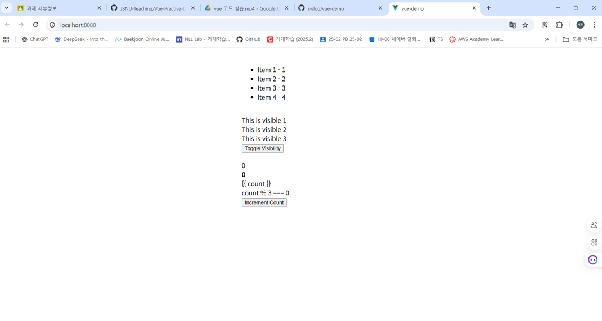
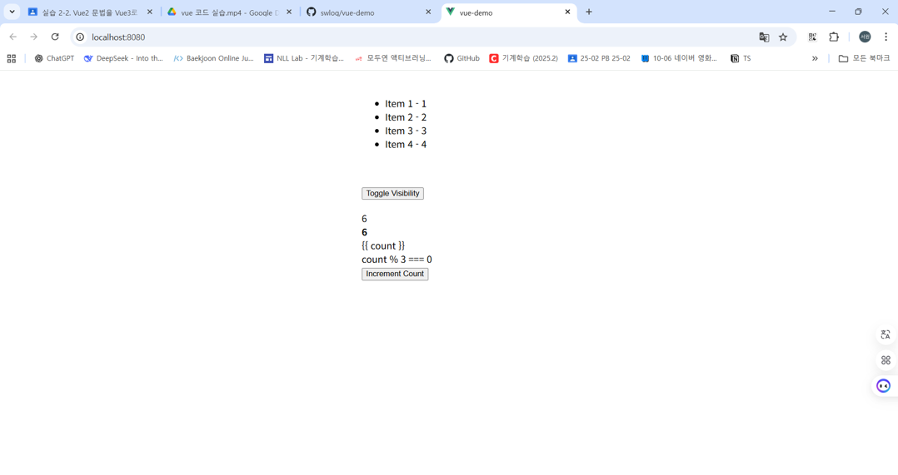
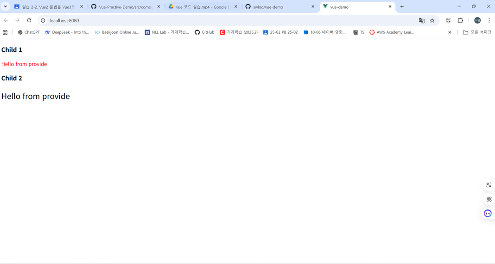
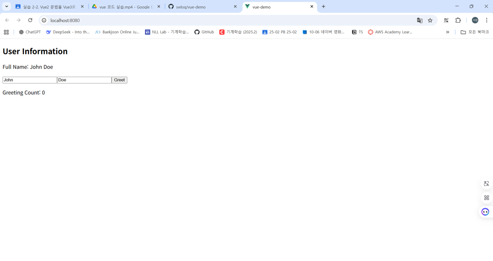
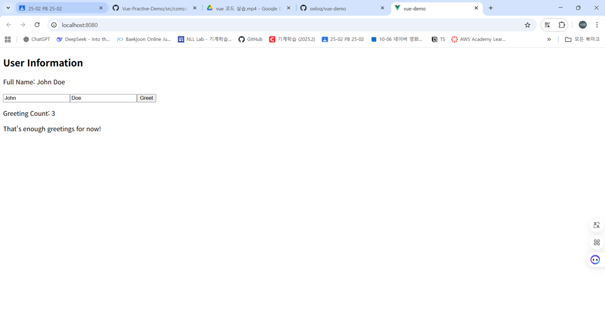

# vue-demo
# Vue2 → Vue3 Migration Examples
본 프로젝트는 Vue 2 기반 예제를 Vue 3 스타일로 리팩터링한 자료입니다.  
기능 추가 없이, 기존 동작과 화면을 그대로 유지하면서 코드 구조를 Vue 3 문법으로 전환했습니다.

## 🔄 공통 변경사항 (전체 컴포넌트 적용)

- **`<script>` → `<script setup lang="ts">`:**  
  모든 컴포넌트에서 Vue 3의 Composition API를 사용하며,  
  TypeScript를 적용하여 타입 안정성 확보.

- **`export default` 제거:**  
  `<script setup>` 문법 사용으로 불필요한 보일러플레이트 코드 제거.

- **컴포넌트 자동 등록:**  
  `components` 옵션 없이 `import`만으로 자동 등록.

---

## E-01-Instance 

### ✅ 변경 요약 (E01Instance.vue)
- **data() → ref():**  
  Vue 2의 `data()` 옵션을 Vue 3의 `ref()` 함수로 대체,`message` 변수를 `ref('Vue!')`로 선언하여 반응형 데이터로 관리.

- **<script> → <script setup>:**    
  Vue 2의 `export default { ... }` 구조를 제거하고 Vue 3의 `<script setup>`을 사용해 컴포넌트 정의를 간소화.

- **name 옵션 제거:**    
  Options API에서 사용하던 `name: "E01Instance"` 속성이 제거. <script setup>을 사용하면 파일이름이 컴포넌트 이름으로 자동 설정
---

### 💡 실행 결과

## E-02-Reactive 

### ✅ 변경 요약

- **data() → ref():**    
  Vue 2의 `data()` 옵션을 Vue 3에서는 `ref()` 함수로 대체,`firstName`,`lastName`을 `ref()`로 선언해 반응형 상태로 관리.

- **computed 속성 변환:**    
  Vue 2의 `computed` 옵션을 Composition API의 `computed()` 함수로 변경,`fullName`을 `computed(() => \`\${firstName.value} \${lastName.value}\`)`로 선언.

- **mounted() → onMounted():**   
  라이프사이클 훅을 Composition API 문법으로 변경,`onMounted(() => { ... })`로 선언하여 동일한 타이밍에 동작.

- **this 제거:**    
  `<script setup>` 내부에서는 `this`를 사용하지 않음,`this.firstName` 대신 `firstName.value` 형태로 접근.

- **Composition API 도입:**    
  `import { ref, computed, onMounted } from 'vue'`를 통해  
  반응형 상태, 계산 속성, 라이프사이클 훅을 명시적으로 관리.

---

### 💡 실행 결과

  
  

## 🧩 E-03-Binding 

### ✅ 변경 요약

- **Composition API 전환:**  
  Vue 2의 Options API(`data`, `methods`)를 Vue 3의 Composition API(`<script setup>`)로 전환.      
  →`import { ref } from 'vue'`를 통해 반응형 상태(`message`, `id`, `password`)를 명시적으로 선언.    
  → 불필요한 `export default` 및 `this` 참조 제거로 코드 구조 단순화.  

- **data() → ref():**    
  Vue 2의 `data()` 옵션을 Composition API의 `ref()`로 변환, `message`, `id`, `password`를 모두 `ref()`로 선언하여 반응형 상태로 관리.

- **메서드 정의 방식 변경:**  
  Vue 2의 `methods` 옵션 대신 Composition API 문법으로 함수 정의.  
  → `const updateMessage = () => { ... }` 형태로 선언.  
  → 버튼 클릭 시 `message.value = ${id.value} ${password.value}` 로 갱신.

- **이벤트 핸들러 변경:**  
  템플릿의 인라인 화살표 함수 `@click="() => { ... }"`를 제거하여 <script setup> 내부에 별도의 `updateMessage 함수`를 정의하여 참조하도록 변경.    
  → `@click="updateMessage"` 형태로 단순화. 

  
---

### 💡 실행 결과

## E-04-Directives

### ✅ 변경 요약

- **data() → ref():**    
  Vue 2의 `data()`에서 관리하던 `isVisible`, `count`, `items`를 Vue 3의 `ref()`로 선언하여 반응형 상태로 관리.  

- **이벤트 핸들러 분리:**    
  Vue 2 템플릿 내부의 인라인 로직(`@click="isVisible = !isVisible"`, `@click="count++"`)을  
  `toggleVisibility()`, `incrementCount()` 함수로 분리하여 `<script setup>` 내부에서 정의.  

- **`.value` 접근 방식 적용:**  
  `ref`로 선언된 변수 접근 시 `.value` 사용 (`isVisible.value`, `count.value++`).  
  → Vue 3의 Proxy 기반 반응형 시스템에 맞게 수정.

- **구조 간소화:**  
  `export default` 구문 제거 후 `<script setup>`으로 전환하여  
  불필요한 보일러플레이트 코드 제거 및 가독성 향상.

---

### 💡 실행 결과

  
  

## example3
이 예제는 **부모 컴포넌트(ParentComponent.vue)**와  
**자식 컴포넌트(ChildComponent.vue)** 간의 **Props 전달과 Emit 이벤트 통신**을  
Vue 2 → Vue 3로 변환한 사례입니다.

### ✅ 변경 요약

- **`data()` → `ref<T>()`:**  
  부모 컴포넌트에서 `parentMessage`를 `ref<string>()`로 선언해 반응형 상태로 관리.  
  TypeScript 제네릭으로 타입 명시.

- **`methods` → 일반 함수 선언:**  
  `methods: { handleEvent(payload) { } }` 구문을  
  `const handleEvent = (payload: string) => console.log(payload)`로 변경.  
  함수 파라미터에 TypeScript 타입 추가.

- **props 정의 방식 변경:**  
  자식 컴포넌트의 `props: ['message', 'id', 'password']`를  
  TypeScript `interface`로 타입 정의 후 `defineProps<Props>()`로 선언.

- **이벤트 전송(`emit`) 변경:**  
  Vue 2의 템플릿 내 `$emit('custom-event', payload)` 구문을  
  `defineEmits<{ 'custom-event': [payload: string] }>()`로 타입과 함께 선언.

---

### 💡 실행 결과

## example4
이 예제는 부모 컴포넌트(ParentComponent.vue)에서  
자식 컴포넌트 2개(ChildComponent1, ChildComponent2)로  
**Provide/Inject 패턴**을 통해 데이터를 전달하는  
Vue 2 → Vue 3 Composition API 변환 사례입니다.

### ✅ 변경 요약

- **`provide()` → `provide()` 함수:**  
  부모 컴포넌트에서 `provide() { return { sharedMessage: '...' } }` 구문을  
  `provide('sharedMessage', 'Hello from provide')`로 변경.  
  `vue`에서 `provide` 함수를 import하여 사용.

- **`inject` → `inject<T>()` 함수:**  
  자식 컴포넌트에서 `inject: ['sharedMessage']` 배열 선언을  
  `const sharedMessage = inject<string>('sharedMessage')`로 변경.  
  TypeScript 제네릭으로 주입되는 값의 타입 명시.

- **깊은 계층 구조에서의 데이터 전달:**  
  ChildComponent1 → ChildComponent2로 이어지는 깊은 계층에서도  
  props drilling 없이 `inject`로 직접 부모의 데이터 접근 가능.

---

## E-07-Options-API
Options API → Composition API 변환 

### ✅ 변경 요약

- **`props` → `defineProps<T>()` + `withDefaults()`:**  
  `props: { title: { type: String, default: '...' } }` 구문을  
  `withDefaults(defineProps<Props>(), { title: 'User Information' })`로 변경.  
  TypeScript interface로 타입 정의 후 기본값 설정.

- **`data()` → `ref<T>()`:**  
  `data() { return { firstName: 'John', ... } }` 구문을  
  각각 `const firstName = ref<string>('John')` 형태로 변경.  
  모든 반응형 데이터를 개별 `ref()`로 선언.

- **`computed` → `computed()`:**  
  `computed: { fullName() { return ... } }` 구문을  
  `const fullName = computed(() => ...)`로 변경.  
  `vue`에서 `computed` 함수를 import하여 사용.

- **`methods` → 일반 함수:**  
  `methods: { greet() { ... } }` 구문을  
  `const greet = () => { ... }`로 변경.  
  화살표 함수 또는 일반 함수로 선언.

- **`watch` → `watch()`:**  
  `watch: { greetCount(newValue, oldValue) { ... } }` 구문을  
  `watch(greetCount, (newValue, oldValue) => { ... })`로 변경.  
  감시할 대상을 첫 번째 인자로 명시.

- **Lifecycle Hooks 변경:**
    - `beforeCreate`, `created` → `setup` 함수 본문 (자동 실행)
    - `beforeMount` → `onBeforeMount()`
    - `mounted` → `onMounted()`
    - `beforeUpdate` → `onBeforeUpdate()`
    - `updated` → `onUpdated()`
    - `beforeUnmount` → `onBeforeUnmount()`
    - `unmounted` → `onUnmounted()`

- **`this` 키워드 제거:**  
  Options API의 `this.firstName`, `this.greet()` 등이  
  Composition API에서는 직접 변수명으로 접근 (`firstName.value`, `greet()`).

---

## E-08-composition-api
Composition API (setup() 함수) → <script setup> 변환

### ✅ 변경 요약

- **`setup(props)` 함수 → `<script setup>` 직접 선언:**  
  `setup(props) { ... return { ... } }` 함수 전체를 제거하고  
  변수와 함수를 최상위에 직접 선언. 자동으로 템플릿에 노출됨.

- **`return` 문 제거:**  
  `setup()` 함수에서 사용하던 변수들을 명시적으로 `return`할 필요 없이  
  선언만으로 템플릿에서 바로 사용 가능.

- **`props` 매개변수 → `defineProps<T>()`:**  
  `setup(props)` 매개변수로 받던 props를  
  `defineProps<Props>()`와 `withDefaults()`로 선언.

- **TypeScript 타입 추가:**  
  모든 `ref()` 선언에 제네릭 타입 명시  
  (`ref<string>()`, `ref<number>()` 등).

---

## example7
Composition API (이중 블록) → <script setup>

### ✅ 변경 요약

- **이중 `<script>` 블록 → 단일 `<script setup>` 블록:**  
  `<script>` (name 정의용)와 `<script setup>` (로직용) 이중 구조를  
  단일 `<script setup lang="ts">` 블록으로 통합.  
  `name` 옵션은 파일명으로 자동 추론되므로 제거.

- **`defineProps()` 타입 정의 방식 변경:**  
  `defineProps({ title: { type: String, default: '...' } })` 구문을  
  TypeScript interface + `withDefaults(defineProps<Props>(), { ... })`로 변경.

- **불필요한 import 제거:**  
  `defineProps`는 `<script setup>`에서 자동으로 사용 가능하므로  
  명시적 import 불필요.

- **TypeScript 타입 추가:**  
  모든 `ref()` 선언에 제네릭 타입 명시.

---

